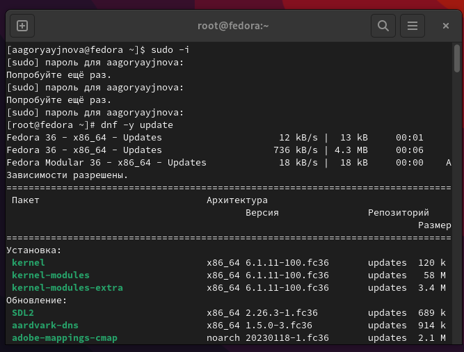
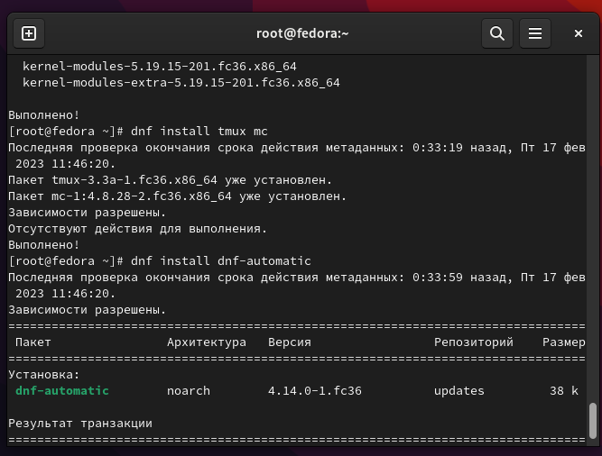
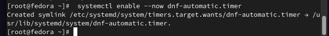
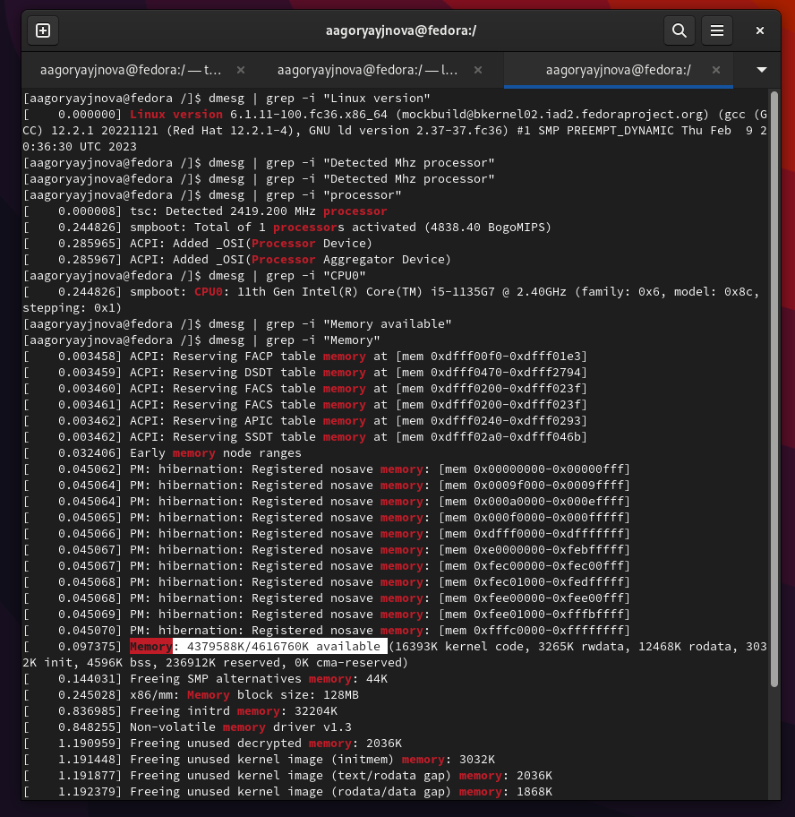
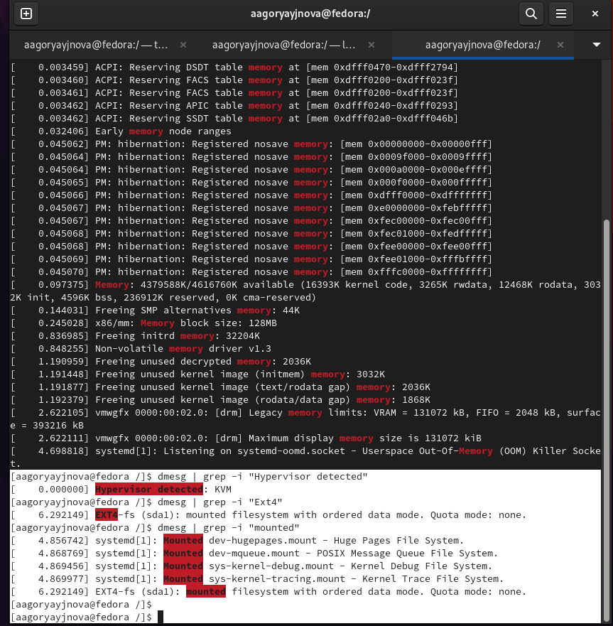

---
## Front matter
title: "Отчёта по лабораторной работе №1"
subtitle: "Установка и конфигурация операционной системы на виртуальную машину"
author: "Горяйнова Алёна Андреева"

## Generic otions
lang: ru-RU
toc-title: "Содержание"

## Bibliography
bibliography: bib/cite.bib
csl: pandoc/csl/gost-r-7-0-5-2008-numeric.csl

## Pdf output format
toc: true # Table of contents
toc-depth: 2
lof: true # List of figures
lot: true # List of tables
fontsize: 12pt
linestretch: 1.5
papersize: a4
documentclass: scrreprt
## I18n polyglossia
polyglossia-lang:
  name: russian
  options:
	- spelling=modern
	- babelshorthands=true
polyglossia-otherlangs:
  name: english
## I18n babel
babel-lang: russian
babel-otherlangs: english
## Fonts
mainfont: PT Serif
romanfont: PT Serif
sansfont: PT Sans
monofont: PT Mono
mainfontoptions: Ligatures=TeX
romanfontoptions: Ligatures=TeX
sansfontoptions: Ligatures=TeX,Scale=MatchLowercase
monofontoptions: Scale=MatchLowercase,Scale=0.9
## Biblatex
biblatex: true
biblio-style: "gost-numeric"
biblatexoptions:
  - parentracker=true
  - backend=biber
  - hyperref=auto
  - language=auto
  - autolang=other*
  - citestyle=gost-numeric
## Pandoc-crossref LaTeX customization
figureTitle: "Рис."
tableTitle: "Таблица"
listingTitle: "Листинг"
lofTitle: "Список иллюстраций"
lotTitle: "Список таблиц"
lolTitle: "Листинги"
## Misc options
indent: true
header-includes:
  - \usepackage{indentfirst}
  - \usepackage{float} # keep figures where there are in the text
  - \floatplacement{figure}{H} # keep figures where there are in the text
---

# Цель работы

Целью данной работы является приобретение практических навыков установки операционной системы на виртуальную машину, настройки минимально необходимых для дальнейшей работы сервисов.

# Задание

- создать виртуальную машину
- установить ОС
- обновить пакеты
- установить программное обеспечение для создания документации

# Выполнение лабораторной работы

Я установила виртуальную машину ещё в 1 семесте, но отчёт у меня, к сожалению, не сохрпнился. Поэтому я делала часть лаб. работы (после установки в.м.)

Перешла в режим супер пользователя, обновила пакеты (рис.1 @fig:001).

{#fig:001 width=70%}

Установка tmux и тд(рис.2 @fig:002)

{#fig:002 width=70%}

Запустила таймер(рис.3 @fig:003)

{#fig:003 width=70%}

Потом я отключила SELinux, установила pandoc и TeX, но не запечатлела это, так как идёт загрузка TeX

# Домашнее задание

Выполнение домашней работы, вся нужная информация на скриншотах (рис.4 @fig:004, рис.5 @fig:005)

{#fig:004 width=70%}

{#fig:005 width=70%}

# Контрольные вопросы

1. Какую информацию содержит учётная запись пользователя?
     Имя аользователя, зашифрованный пароль пользователя, идентификационный номер пользователя, идентификационный номер группы пользователя, домашний каталог пользователя, командный интерпретатор пользователя.

2. Укажите команды терминала и приведите примеры:
- для получения справки по команде -- man <название команды>
- для перемещения по файловой системе -- cd
- для просмотра содержимого каталога -- ls
- для определения объёма каталога -- du <имя каталога>
- для создания / удаления каталогов / файлов -- makedir/rm <имя каталога>, touch/ rm -r <имя файла>
- для задания определённых прав на файл / каталог -- chmod + x <имя файла/каталога>
- для просмотра истории команд -- history

3. Что такое файловая система? Приведите примеры с краткой характеристикой.
     Файловая система – это инструмент, позволяющий операционной системе и программам обращаться к нужным файлам и работать с ними. При этом программы оперируют только названием файла, его размером и датой созданий. Все остальные функции по поиску необходимого файла в хранилище и работе с ним берет на себя файловая система накопителя. 
- UNIX V7: Имена файлов ограничены 14 символами ASCII, кроме косой черты "/" и NUL - отсутствие символа. (в последующих версиях расширены до 255); Поддержка ссылок; Контроль доступа к файлам и каталогам; Имена чувствительны к регистру, my.txt и MY.TXT это разные файлы; Используется схема i-узлов.
- EXT2: Эта файловая система стала основой для LINUX, она очень похожа BSD систему.Вместо групп цилиндров используются группы блоков.

4. Как посмотреть, какие файловые системы подмонтированы в ОС?
     с помощью команды mount
5. Как удалить зависший процесс?
     с помощью команды kill

# Выводы

Я приобрела практические навыки установки операционной системы на виртуальную машину и настройки минимально необходимых для дальнейшей работы сервисов.
ь

::: {#refs}
:::
