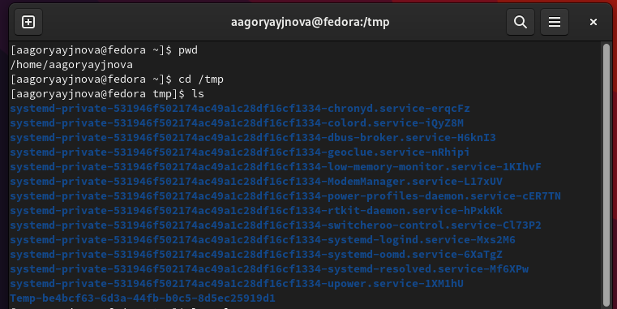

---
## Front matter
lang: ru-RU
title: Лабораторная работа №4
subtitle: Основы интерфейса взаимодействия пользователя с системой Unix на уровне командной строки
author:
  - Горяйнова А. А.
institute:
  - Российский университет дружбы народов, Москва, Россия
date: 01 марта 2023

## i18n babel
babel-lang: russian
babel-otherlangs: english

## Formatting pdf
toc: false
toc-title: Содержание
slide_level: 2
aspectratio: 169
section-titles: true
theme: metropolis
header-includes:
 - \metroset{progressbar=frametitle,sectionpage=progressbar,numbering=fraction}
 - '\makeatletter'
 - '\beamer@ignorenonframefalse'
 - '\makeatother'
---

# Информация

## Докладчик

:::::::::::::: {.columns align=center}
::: {.column width="70%"}

  * Горяйнова Алёна
  * студент физмата
  * Российский университет дружбы народов
 

:::
::::::::::::::

# Цель работы

Приобретение практических навыков взаимодействия пользователя с системой посредством командной строки.

# Задание

1.    Определите полное имя вашего домашнего каталога. Далее относительно этого каталога будут выполняться последующие упражнения.
2.    Выполните следующие действия: 2.1. Перейдите в каталог /tmp. 2.2. Выведите на экран содержимое каталога /tmp. Для этого используйте команду ls с различными опциями. Поясните разницу в выводимой на экран информации. 2.3. Определите, есть ли в каталоге /var/spool подкаталог с именем cron? 2.4. Перейдите в Ваш домашний каталог и выведите на экран его содержимое. Определите, кто является владельцем файлов и подкаталогов?
3.    Выполните следующие действия: 3.1. В домашнем каталоге создайте новый каталог с именем newdir. 3.2. В каталоге ~/newdir создайте новый каталог с именем morefun. 3.3. В домашнем каталоге создайте одной командой три новых каталога с именами letters, memos, misk. Затем удалите эти каталоги одной командой. 3.4. Попробуйте удалить ранее созданный каталог ~/newdir командой rm. Проверьте, был ли каталог удалён. 3.5. Удалите каталог ~/newdir/morefun из домашнего каталога. Проверьте, был ли каталог удалён.

## 

4.  С помощью команды man определите, какую опцию команды ls нужно использовать для просмотра содержимое не только указанного каталога, но и подкаталогов, входящих в него.
5.    С помощью команды man определите набор опций команды ls, позволяющий отсортировать по времени последнего изменения выводимый список содержимого каталога с развёрнутым описанием файлов.
6.    Используйте команду man для просмотра описания следующих команд: cd, pwd, mkdir, rmdir, rm. Поясните основные опции этих команд.
7.    Используя информацию, полученную при помощи команды history, выполните модификацию и исполнение нескольких команд из буфера команд.

# Теоретическое введение

   Основным интерфейсом взаимодействия пользователя с операционной системой UNIX во всех её модификациях была и остается командная строка. Командная строка (или «консоль») – это текстовый интерфейс между человеком и компьютером, в котором инструкции компьютеру даются путём ввода с клавиатуры текстовых строк (команд). Интерфейс командной строки противопоставляется управлению программами на основе меню, а также различным реализациям графического интерфейса. Команды, введённые пользователем, интерпретируются и выполняются специальной программой — командной оболочкой (или «shell» по-английски).

# Выполнение лабораторной работы

## Определили полное имя моего котолога  и перешли в каталог /tmp

{#fig:001 width=70%}

## Различная информаци я о содержимом каталога /tmp

{#fig:002 width=70%}

{#fig:003 width=70%}

{#fig:004 width=70%}

## Определили, что в каталоге /var/spool нет подкаталога cron

{#fig:005 width=70%}

## Перешли в мой домашний каталог и определили кто владелец

{#fig:006 width=70%}

## Ну здесь просто создаем и удаляем с разными опциями, чтоб получилось

{#fig:007 width=70%}

## Каталог ~/newdir не удалился командой rm потому что не пустой

{#fig:008 width=70%}

## Удалили каталог ~/newdir/morefun

{#fig:009 width=70%}

## Нужные опции команды ls

{#fig:010 width=70%}

{#fig:011 width=70%}

{#fig:012 width=70%}

## Описание команд и их опций

{#fig:013 width=70%}

{#fig:014 width=70%}

## Модификация клманды 

{#fig:015 width=70%}

# Выводы

Научилась работать с командной строкой. Изучила различные команды и научилась их применять.

:::

