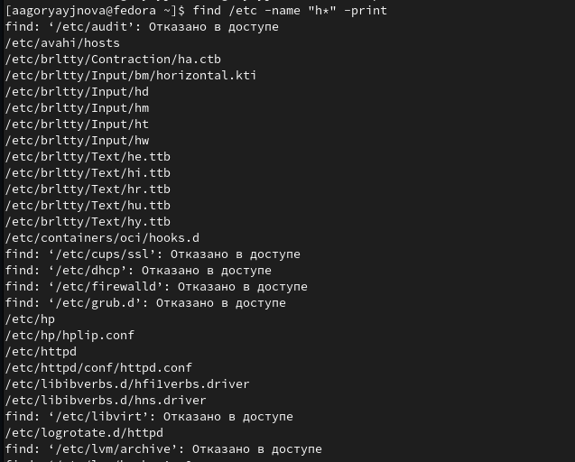

---
## Front matter
lang: ru-RU
title: Лабораторная работ №6
subtitle:  Перенаправление ввода-вывода. Просмотр запущенных процессов
author:
  - Горяйнова АА
institute:
  - Российский университет дружбы народов, Москва, Россия

## i18n babel
babel-lang: russian
babel-otherlangs: english

## Formatting pdf
toc: false
toc-title: Содержание
slide_level: 2
aspectratio: 169
section-titles: true
theme: metropolis
header-includes:
 - \metroset{progressbar=frametitle,sectionpage=progressbar,numbering=fraction}
 - '\makeatletter'
 - '\beamer@ignorenonframefalse'
 - '\makeatother'
---

# Информация

## Докладчик

:::::::::::::: {.columns align=center}
::: {.column width="70%"}

  * Горяйнова АА
  * студент
  * Российский университет дружбы народов
:::
::: {.column width="30%"}

:::
::::::::::::::

# Цель работы

Ознакомление с инструментами поиска файлов и фильтрации текстовых данных.
Приобретение практических навыков: по управлению процессами (и заданиями), по
проверке использования диска и обслуживанию файловых систем.

# Задание

## 
1. Осуществите вход в систему, используя соответствующее имя пользователя.
2. Запишите в файл file.txt названия файлов, содержащихся в каталоге /etc. Допи-
шите в этот же файл названия файлов, содержащихся в вашем домашнем каталоге.
3. Выведите имена всех файлов из file.txt, имеющих расширение .conf, после чего
запишите их в новый текстовой файл conf.txt.
4. Определите, какие файлы в вашем домашнем каталоге имеют имена, начинавшиеся
с символа c? Предложите несколько вариантов, как это сделать.
5. Выведите на экран (по странично) имена файлов из каталога /etc, начинающиеся
с символа h.
6. Запустите в фоновом режиме процесс, который будет записывать в файл ~/logfile
файлы, имена которых начинаются с log.

## 
7. Удалите файл ~/logfile.
8. Запустите из консоли в фоновом режиме редактор gedit.
9. Определите идентификатор процесса gedit, используя команду ps, конвейер и фильтр
grep. Как ещё можно определить идентификатор процесса?
10. Прочтите справку (man) команды kill, после чего используйте её для завершения
процесса gedit.
11. Выполните команды df и du, предварительно получив более подробную информацию
об этих командах, с помощью команды man.
12. Воспользовавшись справкой команды find, выведите имена всех директорий, имею-
щихся в вашем домашнем каталоге

# Выполнение лабораторной работы

## 
Запишeм в файл file.txt названия файлов, содержащихся в каталоге /etc. Допишим в этот же файл названия файлов, содержащихся в вашем домашнем каталоге. 

{#fig:001 width=70%}

{#fig:002 width=70%}

## 
Выведите имена всех файлов из file.txt, имеющих расширение .conf, после чего запишите их в новый текстовой файл conf.txt
{#fig:003 width=70%}

{#fig:004 width=70%}

##
Определите, какие файлы в вашем домашнем каталоге имеют имена, начинавшиеся с символа c? 

{#fig:005 width=70%}

##
Выведите на экран (по странично) имена файлов из каталога /etc, начинающиеся с символа h.

{#fig:006 width=70%}
##
Запустите в фоновом режиме процесс, который будет записывать в файл ~/logfile файлы, имена которых начинаются с log

{#fig:007 width=70%}
##
Удалите файл ~/logfile

{#fig:008 width=70%}
##
Запустите из консоли в фоновом режиме редактор gedit

{#fig:009 width=70%}
##
Определите идентификатор процесса gedit, используя команду ps, конвейер и фильтр grep. Как ещё можно определить идентификатор процесса?

{#fig:010 width=70%}

##
Прочтите справку (man) команды kill, после чего используйте её для завершения процесса gedit

{#fig:011 width=70%}

{#fig:012 width=70%}

##
Выполните команды df и du, предварительно получив более подробную информацию об этих командах, с помощью команды man

{#fig:013 width=70%}

{#fig:014 width=70%}

{#fig:015 width=70%}

{#fig:016 width=70%}

##
Воспользовавшись справкой команды find, выведите имена всех директорий, имеющихся в вашем домашнем каталогe

{#fig:017 width=70%}

# Выводы

В процессе выполнения лабораторной работы ознакомилась с инструментами поиска файлов и фильтрации текстовых данных. Приобрела практические навыки: по управлению процессами (и заданиями), по проверке использования диска и обслуживанию файловых систем.

