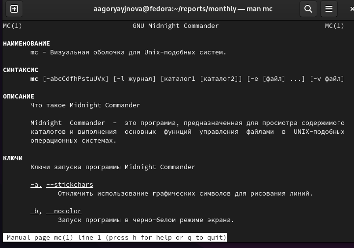
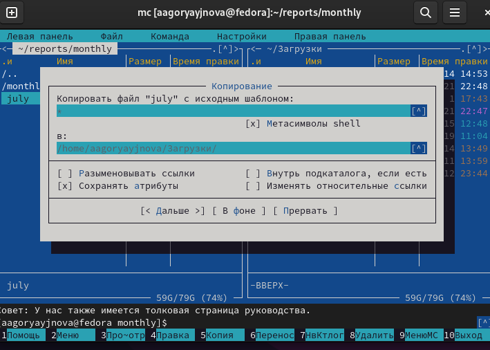
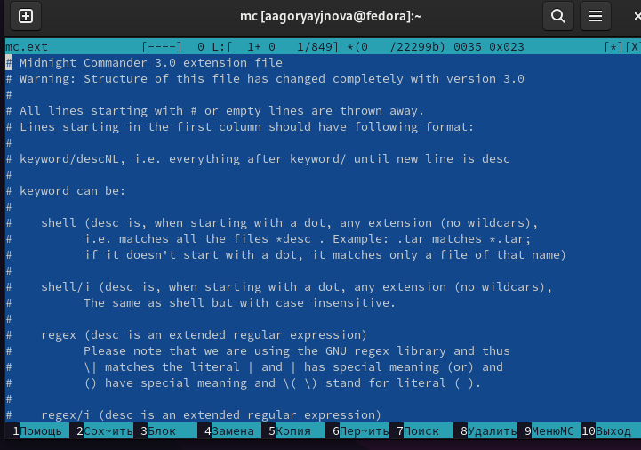
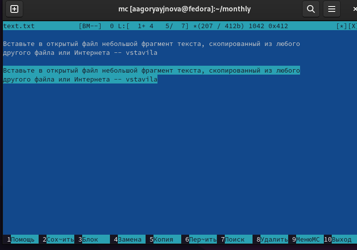
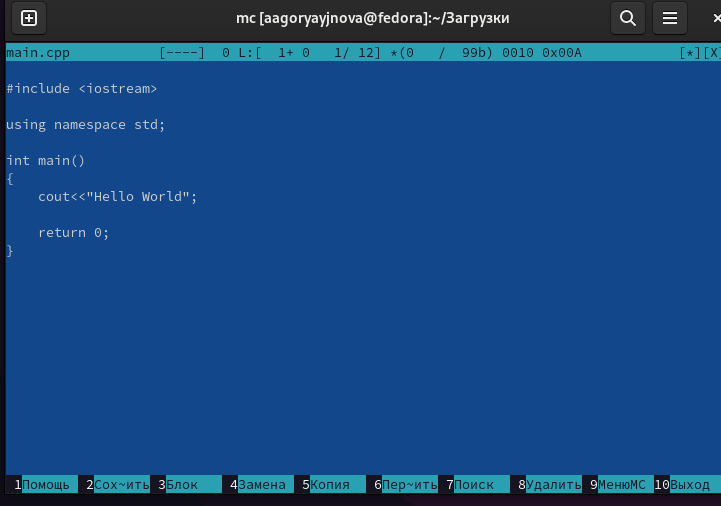

---
## Front matter
lang: ru-RU
title: Отчёт по лабораторной работе 7
author:
  - Горяйнова АА
institute:
  - Российский университет дружбы народов, Москва, Россия

## i18n babel
babel-lang: russian
babel-otherlangs: english

## Formatting pdf
toc: false
toc-title: Содержание
slide_level: 2
aspectratio: 169
section-titles: true
theme: metropolis
header-includes:
 - \metroset{progressbar=frametitle,sectionpage=progressbar,numbering=fraction}
 - '\makeatletter'
 - '\beamer@ignorenonframefalse'
 - '\makeatother'
---

# Информация

## Докладчик

:::::::::::::: {.columns align=center}
::: {.column width="70%"}

  * Горяйнова Алёна
  * студентка
  * Российский университет дружбы народов

:::
::: {.column width="30%"}

:::
::::::::::::::

# Цель работы

Освоение основных возможностей командной оболочки Midnight Commander. Приоб-
ретение навыков практической работы по просмотру каталогов и файлов; манипуляций
с ними.

# Задание

Создайте текстовой файл text.txt.
2. Откройте этот файл с помощью встроенного в mc редактора.
3. Вставьте в открытый файл небольшой фрагмент текста, скопированный из любого
другого файла или Интернета.
4. Проделайте с текстом следующие манипуляции, используя горячие клавиши:  
  4.1. Удалите строку текста.  
  4.2. Выделите фрагмент текста и скопируйте его на новую строку  
  4.3. Выделите фрагмент текста и перенесите его на новую строку.
  4.4. Сохраните файл.  
  4.5. Отмените последнее действие.  
  4.6. Перейдите в конец файла (нажав комбинацию клавиш) и напишите некоторый текст.  
  4.7. Перейдите в начало файла (нажав комбинацию клавиш) и напишите некоторый текст.  
  4.8. Сохраните и закройте файл.  
5. Откройте файл с исходным текстом на некотором языке программирования (например C или Java)
6. Используя меню редактора, включите подсветку синтаксиса, если она не включена,или выключите, если она включена.

# Выполнение лабораторной работы

## 

Информация о программе
(рис. @fig:001).

{#fig:001 width=70%}

##

копирование файла

{#fig:002 width=70%}

##

анализ файла расширений

{#fig:004 width=70%}

##

создание файла и действия с ним (text.txt)

{#fig:005 width=70%}

##

Отключаем подстветку с помощью горячих клавиш

{#fig:007 width=70%}

# Выводы

В процессе выполнения лабораторной работы я освоила работу с командной оболочкой mc. Приобрела практические навыки работы по просмотру каталогов и файлов и по манипуляции с ними.

:::

