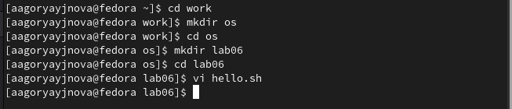
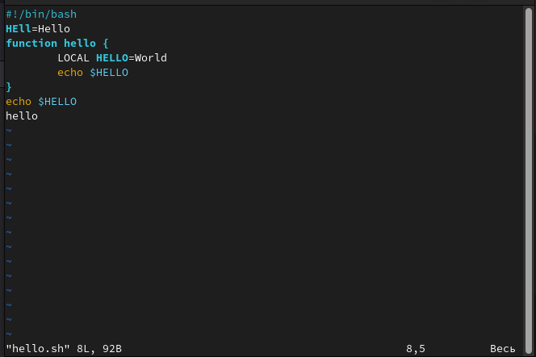
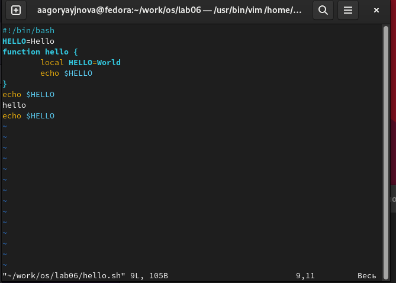

---
## Front matter
lang: ru-RU
title: Лабораторная работа No 8
subtitle: Текстовой редактор vi
author:
  - Горяйнова АА
institute:
  - Российский университет дружбы народов, Москва, Россия

## i18n babel
babel-lang: russian
babel-otherlangs: english

## Formatting pdf
toc: false
toc-title: Содержание
slide_level: 2
aspectratio: 169
section-titles: true
theme: metropolis
header-includes:
 - \metroset{progressbar=frametitle,sectionpage=progressbar,numbering=fraction}
 - '\makeatletter'
 - '\beamer@ignorenonframefalse'
 - '\makeatother'
---

# Информация

## Докладчик

:::::::::::::: {.columns align=center}
::: {.column width="70%"}

  * Горяйнова Алёна
  * студентка 1го курса
  * Российский университет дружбы народов
  * <https://nelagorean.github.io/ru/>

:::
::: {.column width="30%"}

:::
::::::::::::::

# Цель работы

Познакомиться с операционной системой Linux. Получить практические навыки рабо-
ты с редактором vi, установленным по умолчанию практически во всех дистрибутивах.

# Задание

1. Ознакомиться с теоретическим материалом.
2. Ознакомиться с редактором vi.
3. Выполнить упражнения, используя команды vi.

# Выполнение лабораторной работы

##

Создали каталог

{#fig:001 width=70%}

##

Открыли редактор, вставили текст, сохранили изменения и сделали его исполняемым

{#fig:002 width=70%}

##

Отредактировали файл с помощью различных команд и сохранили

{#fig:003 width=70%}

# Выводы

Научились работать с редактором vi
 

:::

