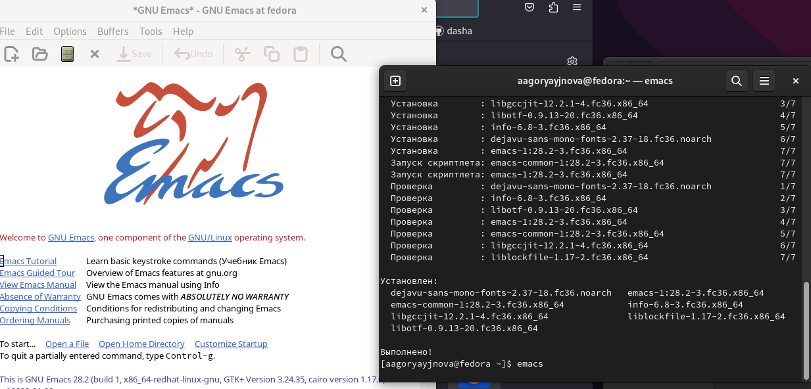
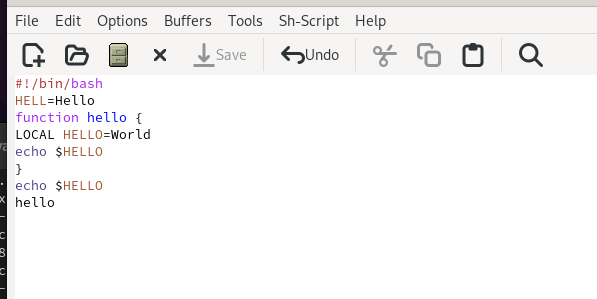
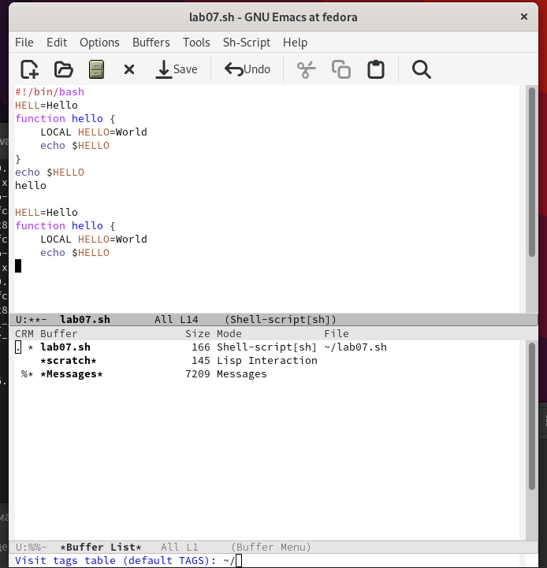
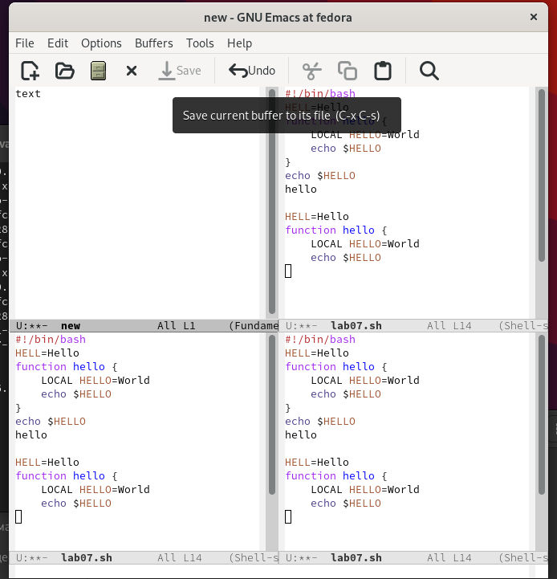
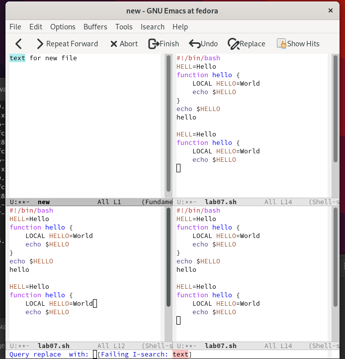
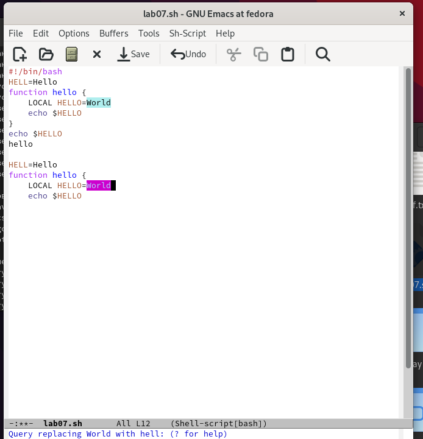

---
## Front matter
lang: ru-RU
title: Лабораторная работа No 9. Текстовой редактор emacs
author:
  - Горяйнова Алёна
institute:
  - Российский университет дружбы народов, Москва, Россия
  
## i18n babel
babel-lang: russian
babel-otherlangs: english

## Formatting pdf
toc: false
toc-title: Содержание
slide_level: 2
aspectratio: 169
section-titles: true
theme: metropolis
header-includes:
 - \metroset{progressbar=frametitle,sectionpage=progressbar,numbering=fraction}
 - '\makeatletter'
 - '\beamer@ignorenonframefalse'
 - '\makeatother'
---

# Информация

## Докладчик

:::::::::::::: {.columns align=center}
::: {.column width="70%"}

  * Горяйнова АА
  * студентка
  * Российский университет дружбы народов

:::
::: {.column width="30%"}

:::
::::::::::::::

# Цель работы

Познакомиться с операционной системой Linux. Получить практические навыки работы с редактором Emacs.

# Задание

1. Ознакомиться с теоретическим материалом.
2. Ознакомиться с редактором emacs.
3. Выполнить упражнения.
4. Ответить на контрольные вопросы.

# Выполнение лабораторной работы

## Скачала и открыла Emacs.

{#fig:001 width=70%}

## Создала документ, написала текст и сохранила

{#fig:002 width=70%}

## Список активных буферов

{#fig:003 width=70%}

## Поделила фрейм на 4 части 

{#fig:004 width=70%}

## Поиск текста

{#fig:005 width=70%}

## Замена текста, но это получается не всегда, пыталась миллион раз)

{#fig:006 width=70%}

# Выводы

Я получила практические навыки работы с редактором Emacs.
