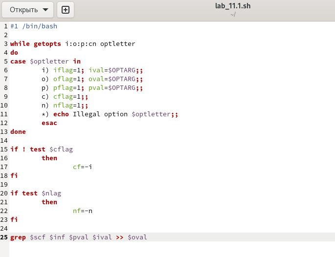
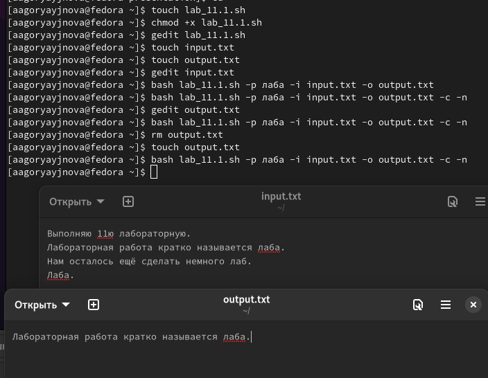
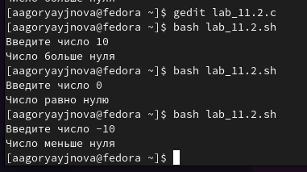
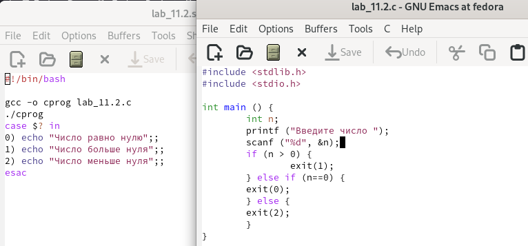
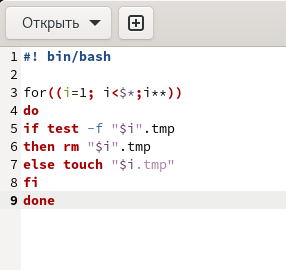
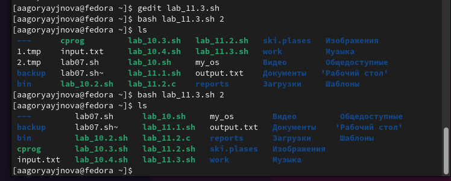
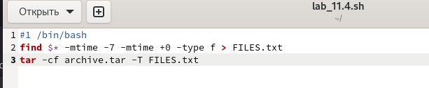
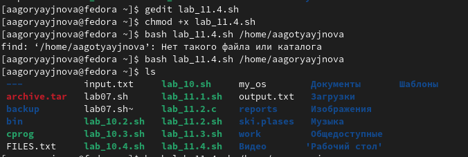

---
## Front matter
lang: ru-RU
title: Лабораторная работа No 11. Программирование в командном процессоре ОС UNIX. Ветвления и циклы
author:
  - Горяйнова Алёна
institute:
  - Российский университет дружбы народов, Москва, Россия

## i18n babel
babel-lang: russian
babel-otherlangs: english

## Formatting pdf
toc: false
toc-title: Содержание
slide_level: 2
aspectratio: 169
section-titles: true
theme: metropolis
header-includes:
 - \metroset{progressbar=frametitle,sectionpage=progressbar,numbering=fraction}
 - '\makeatletter'
 - '\beamer@ignorenonframefalse'
 - '\makeatother'
---

# Информация

## Докладчик

:::::::::::::: {.columns align=center}
::: {.column width="70%"}

  * Горяйнова Алёна
  * студентка
  * Российский университет дружбы народов

:::
::: {.column width="30%"}

:::
::::::::::::::

# Цель работы

Изучить основы программирования в оболочке ОС UNIX. Научится писать более
сложные командные файлы с использованием логических управляющих конструкций
и циклов

# Задание

  1.  Используя команды getopts grep, написать командный файл, который анализирует командную строку с ключами:
   - iinputfile — прочитать данные из указанного файла;
   - ooutputfile — вывести данные в указанный файл;
   - pшаблон — указать шаблон для поиска;
   - C — различать большие и малые буквы;
   - n — выдавать номера строк. а затем ищет в указанном файле нужные строки, определяемые ключом -p.

  2.  Написать на языке Си программу, которая вводит число и определяет, является ли оно больше нуля, меньше нуля или равно нулю. Затем программа завершается с помощью функции exit(n), передавая информацию в о коде завершения в оболочку. Командный файл должен вызывать эту программу и, проанализировав с помощью команды $?, выдать сообщение о том, какое число было введено.
   3. Написать командный файл, создающий указанное число файлов, пронумерованных последовательно от 1 до N (например 1.tmp, 2.tmp, 3.tmp,4.tmp и т.д.). Число файлов, которые необходимо создать, передаётся в аргументы командной строки. Этот же командный файл должен уметь удалять все созданные им файлы (если они существуют).
  4.  Написать командный файл, который с помощью команды tar запаковывает в архив все файлы в указанной директории. Модифицировать его так, чтобы запаковывались только те файлы, которые были изменены менее недели тому назад (использовать команду find).

# Выполнение лабораторной работы

  1.  Используя команды getopts grep, написать командный файл, который анализирует командную строку с ключами:

   - iinputfile — прочитать данные из указанного файла;
   - ooutputfile — вывести данные в указанный файл;
   - pшаблон — указать шаблон для поиска;
   - C — различать большие и малые буквы;
   - n — выдавать номера строк. а затем ищет в указанном файле нужные строки, определяемые ключом -p. 

{#fig:00 width=70%}

{#fig:00 width=70%}

## 2. Написать на языке Си программу, которая вводит число и определяет, является ли оно больше нуля, меньше нуля или равно нулю. Затем программа завершается с помощью функции exit(n), передавая информацию в о коде завершения в оболочку. Командный файл должен вызывать эту программу и, проанализировав с помощью команды $?, выдать сообщение о том, какое число было введено.

{#fig:003 width=70%}

{#fig:004 width=70%}

## 3. Написать командный файл, создающий указанное число файлов, пронумерованных последовательно от 1 до N (например 1.tmp, 2.tmp, 3.tmp,4.tmp и т.д.). Число файлов, которые необходимо создать, передаётся в аргументы командной строки. Этот же командный файл должен уметь удалять все созданные им файлы (если они существуют). 
 
{#fig:005 width=70%}

{#fig:006 width=70%}

## 4. Написать командный файл, который с помощью команды tar запаковывает в архив все файлы в указанной директории. Модифицировать его так, чтобы запаковывались только те файлы, которые были изменены менее недели тому назад (использовать команду find).

{#fig:007 width=70%}

{#fig:008 width=70%}

# Выводы

В процессе выполнения данной лабораторной работы я изучила основы программирования в оболочке ОС UNIX. Научилась писать более сложные командные файлы с использованием логических управляющих конструкций и циклов.

