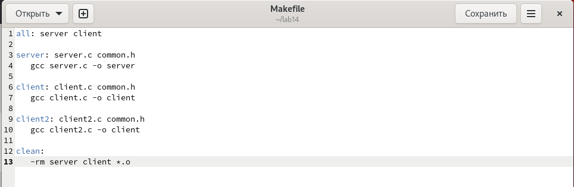
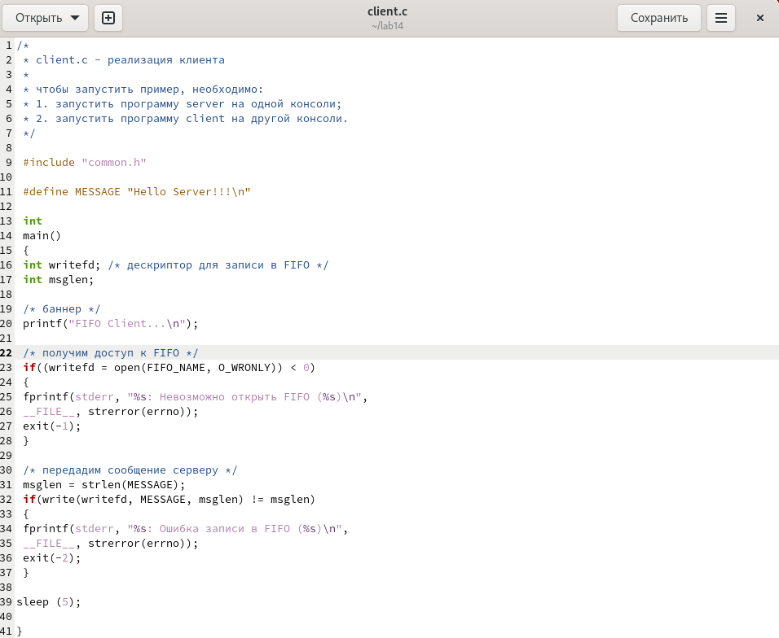
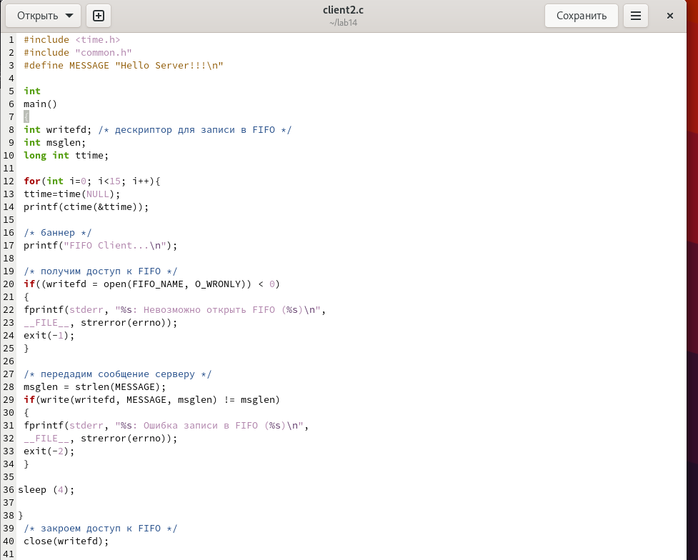
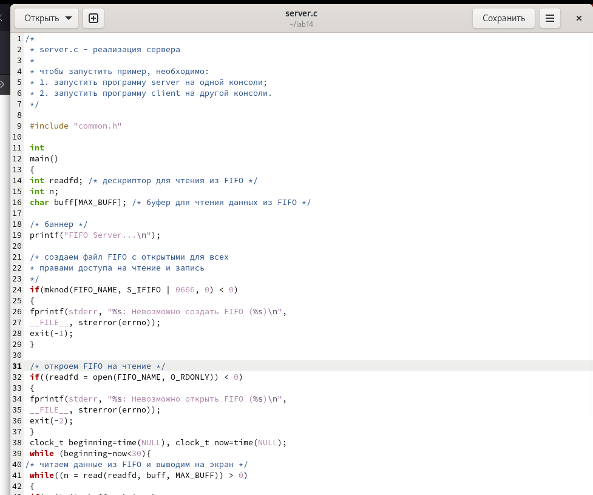

---
## Front matter
lang: ru-RU
title: Лабораторная работа №14
subtitle: Именованные каналы
author:
  - Горяйнова АА
institute:
  - Российский университет дружбы народов, Москва, Россия

## i18n babel
babel-lang: russian
babel-otherlangs: english

## Formatting pdf
toc: false
toc-title: Содержание
slide_level: 2
aspectratio: 169
section-titles: true
theme: metropolis
header-includes:
 - \metroset{progressbar=frametitle,sectionpage=progressbar,numbering=fraction}
 - '\makeatletter'
 - '\beamer@ignorenonframefalse'
 - '\makeatother'
---

# Информация

## Докладчик

:::::::::::::: {.columns align=center}
::: {.column width="70%"}

  * Горяйнова Алёна
  * студентка
  *
:::
::: {.column width="30%"}

:::
::::::::::::::

# Цель работы

Приобретение практических навыков работы с именованными каналами.

# Задание

Изучите приведённые в тексте программы server.c и client.c. Взяв данные примеры за образец, напишите аналогичные программы, внеся следующие изменения:

  1.   Работает не 1 клиент, а несколько (например, два).
  2.  Клиенты передают текущее время с некоторой периодичностью (например, раз в пять секунд). Используйте функцию sleep() для приостановки работы клиента.
  3.  Сервер работает не бесконечно, а прекращает работу через некоторое время (напри- мер, 30 сек). Используйте функцию clock() для определения времени работы сервера. Что будет в случае, если сервер завершит работу, не закрыв канал?

# Выполнение лабораторной работы

Подправленные коды 
(рис. @fig:001, @fig:002, @fig:003, @fig:004).

{#fig:001 width=70%}

## {#fig:002 width=70%}

## {#fig:003 width=70%}

## {#fig:00 width=70%}

# Выводы

В процессе выполнения лабораторной работы я приобрела практические навыки работы с именованными каналами.

